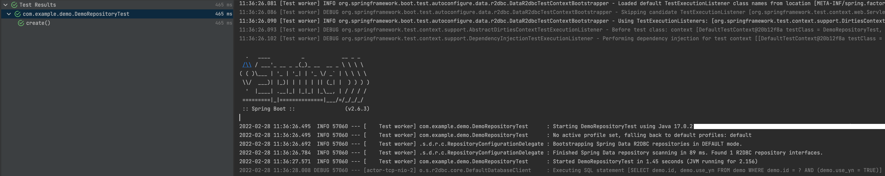
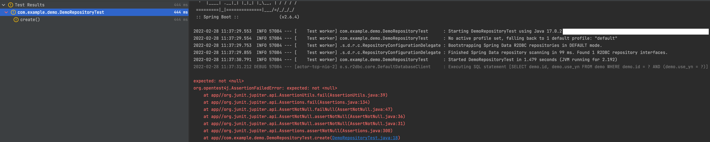

# for issue spring boot 2.6.4

## preparation
1. docker compose 
```
version: "3"
services:
  mysql:
    restart: always
    image: mysql:5.7.33
    container_name: mysql-server
    ports:
      - "3306:3306"
    environment:
      - MYSQL_RANDOM_ROOT_PASSWORD=yes
    entrypoint:
      sh -c "
        echo \"CREATE DATABASE IF NOT EXISTS demo; CREATE USER admin@'%' IDENTIFIED BY 'password'; GRANT ALL PRIVILEGES ON *.* TO admin@'%';\" > /docker-entrypoint-initdb.d/init.sql;
        /usr/local/bin/docker-entrypoint.sh --character-set-server=utf8mb4 --collation-server=utf8mb4_general_ci
      "
```

2. create table and insert data
```
CREATE TABLE IF NOT EXISTS `demo` (
`id` SERIAL PRIMARY KEY,
`use_yn` bit(1) NOT NULL DEFAULT b'1' COMMENT '사용여부'
);

INSERT INTO `demo` VALUES (1, b'1');
```

## Test
Run DemoRepositoryTest
1. version 2.6.3

2. version 2.6.4
